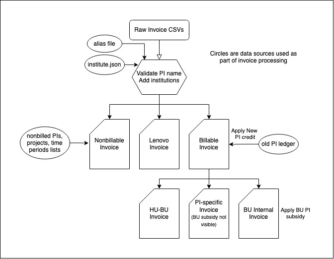

# Process CSV reports

The processing script `process_report.py` takes in the monthly invoices and goes through several processing and exporting steps:
1. Combines all provided invoices (more info below)
2. Check for PI aliases in invoices
3. Obtain each PI's institution name
4. Exports the non-billable invoice (more info below) and Lenovo invoice
5. Apply the New PI credit (more info below)
6. Exports the billable invoice
7. Export the HU-BU invoice, PI-specific invoice, and the BU Internal invoice which applies the BU subsidy

The flowchart below summarizes the invoices being created and their dependencies:



The CSV invoices must at least contain the following headers:
- Invoice Month
- Project - Allocation
- Manager (PI)
- Institution
- SU Hours (GBhr or SUhr)
- SU Type
- Cost

```
usage: process_report.py [-h] [--fetch-from-s3] [--upload-to-s3] --invoice-month INVOICE_MONTH --pi-file PI_FILE --projects-file PROJECTS_FILE --timed-projects-file
                         TIMED_PROJECTS_FILE [--nonbillable-file NONBILLABLE_FILE] [--output-file OUTPUT_FILE] [--output-folder OUTPUT_FOLDER]
                         [--BU-invoice-file BU_INVOICE_FILE] [--HU-BU-invoice-file HU_BU_INVOICE_FILE] [--Lenovo-file LENOVO_FILE] [--old-pi-file OLD_PI_FILE]
                         [--alias-file ALIAS_FILE] --BU-subsidy-amount BU_SUBSIDY_AMOUNT
                         [csv_files ...]
process_report.py: error: the following arguments are required: --invoice-month, --pi-file, --projects-file, --timed-projects-file, --BU-subsidy-amount

E.g. python process_report.py test1.csv test2.csv --invoice-month 2024-02 --pi-file pi.txt --projects-file projects.txt --timed-projects-file timed_projects.txt --BU-subsidy-amount 100
```

## New PI Credit
Applies the New PI credit, which is a credit applied for PIs who have not created a project on the NERC. An file containing a list of known PIs and their date of first appearace must be provided

The file of old pis may look like this:
```
alice@example.edu,2024-01
bob@example.com,2023-11
```

## Non-Billable

Automates the process of removing non-billable PIs and projects from the supplied csv report.

A file containing list of PIs may look like:

pi.txt
```
alice@example.com
bob@example.com
foo
bar
```

A file containing list of projects to be excluded may look like:

projects.txt
```
foo
bar
blah blah
```

A file containing list of timed projects will looks like this:
```
PI,Project,Start Date,End Date,Reason
alice@example.com,project foo,2023-09,2024-08,Internal
bo@example.com,project bar,2023-09,2024-08,Internal
```

The script will gather the invoice month from the csv reports and if it falls under the start and end date then those projects will be excluded.
In this example, `project foo` will not be billed for September 2023 and August 2024 and all the months in between for total of 1 year.

## Combine CSVs

This script also combines the 3 separate Invoice data CSVs into 1 Invoice CSV. It combines
OpenShift SU, OpenStack SU, and Storage SU data.
